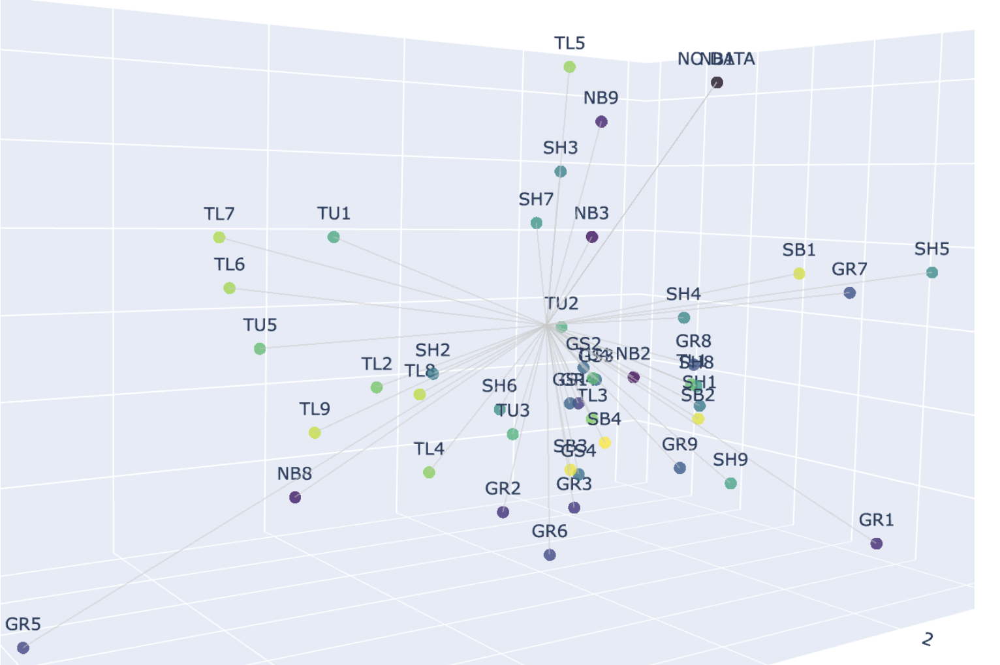

# Pushing the "Next Day Wildfire Spread" benchmark
#### *High-resolution satellite data + vector embedding of fuels data + equivariant convolutional networks*
##### George Hulsey, September 2024

This work is inspired by, based on, and uses code from "[Next Day Wildfire Spread: A Machine Learning Dataset to Predict Wildfire Spreading From Remote-Sensing Data](https://ieeexplore.ieee.org/document/9840400)", 
from Huot et al (Google Research). Next Day Wildfire Spread == NDWS.

To run the code, create a conda environment from the .yml file to install necessary packages. 

The code relies heavily on Google Earth Engine, for which you will need an API key for access (especially in Jupyter notebooks). The dataset records are exported as TFRecords but read as PyTorch iterable dataset objects, and the models are built and trained in the PyTorch framework. 

### What's new compared to NDWS classic

The "classic" NDWS dataset uses MODIS fire data along with a host of meterological and topographical covariates. That dataset ([available on Kaggle](https://www.kaggle.com/datasets/fantineh/next-day-wildfire-spread/data)) has a native spatial resolution of 1km, and covers almost a decade from 2012-2020. 

The goal of this project is to improve the dataset for NDWS prediction and improve the models' performance on the task. The new dataset is mNDWS: modified Next Day Wildfire Spread,

In particular, the following modifications are made: 
* VIIRS satellite detctions are used in lieu of MODIS, enabling the dataset to reach spatial resolution 500m
* The geographical region is restricted to the continental United States west of the 100th meridian (the CONUS West region)
* The temporal range of data is from 2018-2023 (but can be easily extended)
* New weather and topographical covariates are included
* Masks for developed impervious surface and water coverage are included
* An auxiliary model is trained to (semi)losslessly downsample and vector-embed fuel data

The dataset will be published on Kaggle soon, and a paper will also be published in the future. 

Below is an example of the covariates and fire masks in the dataset. 

### Vector embedding of fuel categories

LANDFIRE releases the [Scott & Burgan 40 fire behavior fuel models](https://www.fs.usda.gov/rm/pubs_series/rmrs/gtr/rmrs_gtr153.pdf) (FBFM40), a classification designed to fall along lines with distinguishable fire behavior. However, this is far too many features to resonably one-hot encode for the purposes of a CNN. Some work manually/through domain knowledge reduces this to a small subset of features, but we use a deep learning-centric approach. 

The FBFM40 fuel data is natively in 30m resolution, so sampling at 500m corresponds to mapping a (approximate) 16x16 image to a vector. Here, a convolutional autoencoder is trained and employed to do this task while (semi)losslessly preserving the information about proportion of each fuel type in the grid. The latent space (dim = 3, here) then characterizes three fuel bands which form three unique fuel indices defined by the model. These are used to construct new GeoTiffs and imported along with the rest of the data. The inclusion of fuel data in mNDWS is an important novel aspect compared to NDWS, which did not consider landcover classes. 

A visualization of the 40 categories (i.e. the image of 16x16 uniform arrays) in the learned latent space is picture below. 

